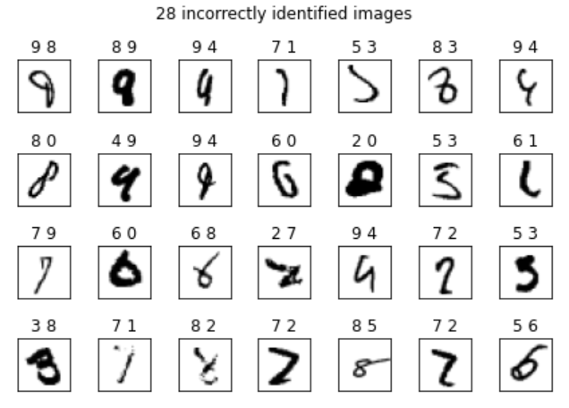

# mnist_99.7_pytorch
MNIST classification in Pytorch, the accuracy of the test set is 99.72%

# Some key points
- Powerful CNN architecture
- BatchNorm
- Dropout
- Data augmentation
- Multiple model voting

# 28 incorrectly identified images

# Useful links
1. [How to score 97%, 98%, 99%, and 100%](https://www.kaggle.com/c/digit-recognizer/discussion/61480)
2. [25 Million Images! [0.99757] MNIST](https://www.kaggle.com/cdeotte/25-million-images-0-99757-mnist/data)
3. [The MNIST Database of Handwritten Digit Images for Machine Learning Research](https://www.microsoft.com/en-us/research/wp-content/uploads/2016/02/MNIST-SPM2012.pdf)
